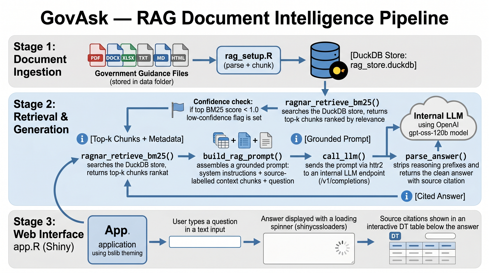
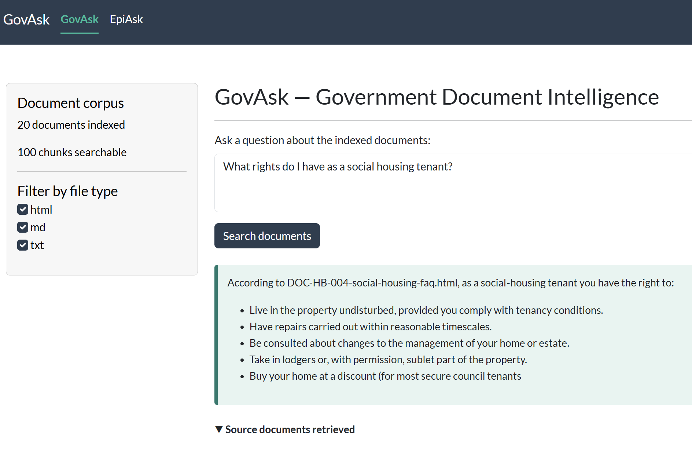

# 🏛️ GovASK — Government Document Intelligence

> **AI Engineering Lab Hackathon 2026 · Challenge 2: Unlocking the Dark Data**  
> Team: Harshana · Emma · Freddie · UKHSA Epidemiology Data Science

[View presentation slides →](docs/presentation.html)

---

## The problem

A government frontline adviser is on a call. They need the right guidance — quickly. They open a shared drive and find three documents with similar names and different dates. They're not sure which is current. They put the caller on hold and keep searching. They give an answer based on whichever version they found fastest.

It may not be the right one.

This is not a failure of effort. It is a failure of infrastructure. Government produces an enormous volume of guidance, policy, and procedural documentation. Most of it is published. Very little of it is genuinely findable under time pressure — and almost none of it is queryable by a machine.


---

## What we built

A **Retrieval-Augmented Generation (RAG)** document intelligence system that:

- Ingests government guidance documents in **six file formats** (PDF, DOCX, XLSX, TXT, Markdown, HTML)
- Indexes them in a persistent, restartable **BM25 full-text search store** (DuckDB)
- Answers plain-English questions using an **internally-hosted LLM** — no data leaves the network
- Returns answers **grounded in the source documents**, with the exact file and passage cited
- Surfaces all of this through a **browser-based Shiny interface** — no installation required for end users

A user types a question. They get an answer. They can see exactly which document it came from and verify it in seconds.



---

## Example output


---

## Architecture

```
challenge-2/
├── structured_files/    20 HTML, Markdown, plain-text policy documents
└── unstructured_files/  23 DOCX, PDF, XLSX departmental documents
         │
         ▼  ingest_all.R — PARSER_REGISTRY dispatch by file extension
         │
data/rag_store.duckdb    chunks + BM25 index + file-type metadata (persistent)
         │
         ▼  rag_query.R — BM25 retrieval → prompt builder → LLM call
         │
         ▼  app.R — R Shiny browser interface
              ┌─────────────────────────────────────────────┐
              │  Question input                             │
              │  Submit → spinner → grounded answer         │
              │  Source citation table (doc · score · text) │
              │  ⚠ Low-confidence warning if BM25 weak      │
              └─────────────────────────────────────────────┘
```

Full indexing of the challenge-2 corpus completes in under 2 minutes on a standard laptop. Query response — retrieval plus LLM generation — is typically under 5 seconds.

### Why BM25, not vector embeddings?

BM25 (Best Matching 25) is the industry-standard keyword relevance algorithm — it powers Elasticsearch and most production search engines. For structured government documents it performs exceptionally well and has three properties that matter in a government context:

- **Transparent** — every relevance score is explainable
- **Offline** — no embedding model or GPU required
- **Auditable** — the exact passages that drove an answer are always retrievable

A hybrid BM25 + semantic re-ranking approach is the planned next step (see [What's next](#whats-next)).

### Why DuckDB?

DuckDB is an embedded analytical database — think SQLite optimised for analytical queries. The ragnar package uses it to persist the chunk store and BM25 index as a single `.duckdb` file that survives restarts, can be backed up, and never requires a running database server.

### The LLM — GPT-OSS 120B on OpenShift AI

The generation layer uses **GPT-OSS 120B**, a 120-billion-parameter open-weights model hosted on an internal Red Hat OpenShift AI cluster within UKHSA's own infrastructure. It is served via an OpenAI-compatible API (`/v1/completions`) and accessed exclusively over the internal network.

At 120B parameters this is a frontier-class model — comparable in capability to commercially available models — but running entirely under our own control. For a RAG system grounding answers in retrieved passages, a model of this scale handles nuanced government language, policy terminology, and cross-referencing across multiple source chunks reliably.

**Why this matters for government use:**

- **No data in transit to third parties.** Queries, retrieved passages, and generated answers never leave the UKHSA network boundary. There is no commercial API call, no cloud inference endpoint, no terms-of-service ambiguity about data handling.
- **Zero commercial training use.** Because the model is self-hosted, query data is categorically not used to train or fine-tune any commercial model. This is a hard guarantee, not a contractual assurance subject to policy change.
- **Reproducible and auditable inference.** The model version is fixed at deployment time. Answers are deterministic at low temperature (`0.1`). The same question against the same corpus will produce the same answer — a property that matters when answers may be cited in operational decisions.
- **Swap-ready architecture.** The pipeline calls the model via a single `httr2` function against the OpenAI-compatible endpoint. Upgrading to a newer model version, or switching to a different open-weights model, requires changing one environment variable — not rewriting the pipeline.

### Why R?

Our team's domain expertise, our organisation's analytical infrastructure, and the users we're building for are all in R. Public health data scientists and epidemiologists across UK government work in R daily — a RAG pipeline built here is immediately usable by them without adopting a new language, new tooling, or new deployment patterns.

This also demonstrates something the AI Engineering Lab cares about: **GitHub Copilot works effectively in R.** Most AI coding tool demonstrations default to Python or TypeScript. This project is evidence that analysts in any language — including those in government departments running predominantly R and SAS workflows — can use Copilot to build production-quality AI systems. The `ragnar` and `ellmer` packages are not toy wrappers; they are Tidyverse-ecosystem tools built for exactly this use case.

---

## Supported file types

| Format | R package | Notes |
|--------|-----------|-------|
| `.pdf` | `pdftools` | Page-by-page extraction, pure R |
| `.docx` | `officer` | Paragraph and table cell extraction |
| `.xlsx` / `.xls` | `readxl` | All sheets; column names preserved as context |
| `.txt` | `readr` | Direct read |
| `.md` | `commonmark` | Markdown syntax stripped to plain text |
| `.html` | `xml2` + `rvest` | Script/style nodes removed before extraction |

All parsers follow a single interface: `extract_text_<format>(file_path) → character(1)`. Adding a new format means registering one function in `PARSER_REGISTRY` — no other changes required.

---

## How GitHub Copilot shaped this build

This project was built using GitHub Copilot throughout. We set up the repository for Copilot **before writing any new code**, which meant every suggestion was project-aware from the first prompt.

### Repository setup

```
.github/
├── copilot-instructions.md          # Always-on project brief for all Copilot interactions
├── instructions/
│   ├── r-coding-standards.instructions.md    # applyTo: **/*.R
│   ├── shiny-ui.instructions.md              # applyTo: app.R
│   └── rag-pipeline.instructions.md          # applyTo: rag_*.R, ingest*.R
└── skills/
    ├── r-file-parser/SKILL.md       # Procedural knowledge for writing file parsers
    ├── rag-prompt-engineering/SKILL.md  # Prompt design patterns and evaluation framework
    └── shiny-component/SKILL.md     # Shiny UI component patterns and reactive conventions
```

`copilot-instructions.md` gives Copilot the full project architecture, package list, LLM endpoint type, and coding conventions. It never has to be told what `ragnar` is, not to suggest Python, or which endpoint path to use.

The three `.instructions.md` files activate only on matching file types — keeping Copilot's context focused rather than injecting everything into every request.

The three **Skills** in `.github/skills/` are on-demand procedural knowledge packages — a newer Copilot feature that lets agents load specialised guidance only when the task requires it. Each Skill was authored by the team member who owned that domain.

### Copilot features used and where

| Feature | Used for |
|---------|----------|
| **Agent mode** | Generating all six file-type parsers from the `r-file-parser` SKILL.md pattern |
| **Copilot Chat + `#file`** | Wiring the Shiny server function to `rag_query.R` functions |
| **Inline completions** | `tryCatch()` blocks, `httr2` pipe chains, tibble column access |
| **`/explain`** | Understanding `ragnar_store_build_index()` internals; `officer::docx_summary()` schema |
| **`/fix`** | XLSX parser NA handling; `shinycssloaders` spinner syntax |
| **`/tests`** | Generating test cases for parser functions (empty file, NA cells, missing columns) |
| **Copilot code review** | Reviewing Freddie's multi-format ingestion PR before merging to main |
| **Custom instructions** | Project-wide R conventions enforced automatically — no re-explaining context |
| **Skills (`.github/skills/`)** | Domain-specific procedural knowledge loaded on demand by Copilot agents |

### What Copilot changed about our workflow

The honest answer is: it changed the shape of the day entirely.

**Without Copilot**, writing six file-type parsers would have meant reading six package documentation pages, writing boilerplate error handling from scratch, and manually aligning function signatures across three team members working in parallel. That is a morning's work for a three-person team.

**With Copilot**, each parser was generated in one Agent mode session using the `r-file-parser` SKILL.md as context. The function signatures, `tryCatch()` patterns, NA guards for XLSX cells, and metadata attachment were all produced correctly on the first attempt — because the Skill had defined the contract in advance. The DOCX parser, XLSX parser, and plain-text parsers were written, tested, and integrated into the dispatch registry in under 90 minutes across the whole team.

The `shiny-component` SKILL.md meant Emma's Shiny scaffold used the same reactive patterns and styling constants that Harshana had defined — without any manual synchronisation between them. Two people, different files, consistent output. This is what good AI-assisted team development looks like.

The Copilot PR review on Freddie's ingestion module caught a missing `tryCatch()` around the DOCX parser before it reached the demo corpus — a failure that would have crashed the indexing run silently on a protected Word file.

The `copilot-instructions.md` file meant that from the first prompt, Copilot knew the architecture, the LLM endpoint type, the package list, and the coding conventions. It never suggested Python. It never asked what `ragnar` was. It never tried to use the wrong API path. That persistent, shared context is what makes the difference between Copilot as a novelty and Copilot as a genuine team member.

**The broader point for government teams:** the `.github/skills/` pattern used here is not specific to this project. Any R team in any department could create a Skills file for their own domain — epidemiological modelling conventions, statistical disclosure control rules, GOV.UK design system patterns — and give every team member, regardless of experience level, consistent access to that institutional knowledge through their coding tool. The setup cost is one afternoon. The benefit compounds across every subsequent piece of work.

---

## Setup

### Prerequisites

All dependencies are pure CRAN packages — no system install rights required.

```r
install.packages(c(
  "ragnar", "ellmer", "pdftools", "officer", "readxl",
  "readr", "commonmark", "xml2", "rvest",
  "shiny", "bslib", "DT", "shinycssloaders", "httr2"
))
```

### Configure LLM credentials

Create `.Renviron` in the project root (this file is git-ignored — never commit it):

```
LLM_URL=https://your-internal-llm-endpoint
LLM_MODEL=your-model-name
GPT_TOKEN=your-token-here
```

### Step 1 — Index documents

```r
source("ingest_all.R")
```

Place documents in `challenge-2/structured_files/` and/or `challenge-2/unstructured_files/`. The pipeline discovers all supported file types automatically.

Expected output:

```
Found 43 file(s) to ingest across 6 format(s).

Processing: housing_eligibility_guidance.md  →  12 chunks
Processing: benefits_overview_2024.pdf       →  31 chunks
Processing: procurement_thresholds.docx      →  8 chunks
...

Building BM25 index...
Done. 43 file(s) indexed, 287 chunk(s) total.
Store: data/rag_store.duckdb
```

### Step 2 — Launch the interface

```r
shiny::runApp("app.R")
```

Open the URL shown in the console. No further installation needed for end users.

---

## Project structure

```
GovASK/
├── .github/
│   ├── copilot-instructions.md
│   ├── instructions/
│   │   ├── r-coding-standards.instructions.md
│   │   ├── shiny-ui.instructions.md
│   │   └── rag-pipeline.instructions.md
│   └── skills/
│       ├── r-file-parser/SKILL.md
│       ├── rag-prompt-engineering/SKILL.md
│       └── shiny-component/SKILL.md
├── challenge-2/
│   ├── structured_files/     # 20 HTML/MD/TXT policy documents
│   └── unstructured_files/   # 23 DOCX/PDF/XLSX departmental documents
├── data/
│   └── rag_store.duckdb      # Generated — rebuild with ingest_all.R
│                             # Excluded from git — safe to delete and rebuild
├── ingest_all.R              # STEP 1: ingest all file types, build BM25 index
├── rag_query.R               # STEP 2: retrieval, prompt, LLM call (also used by Shiny)
├── app.R                     # STEP 3: Shiny browser interface
├── .Renviron                 # LLM credentials — NEVER commit this file
├── .gitignore
└── README.md
```

### Branching strategy

In normal team development we work on `main`, `dev`, and short-lived `feature/*` branches — feature branches are opened against `dev`, reviewed, and merged before `dev` is promoted to `main`. For this hackathon we applied a pragmatic version of that: each team member worked on a named branch (`ingest`, `shiny`, `rag-tuning`), raised pull requests to `dev` as features were completed, and used Copilot's code review on each PR before merging. `main` was kept in an always-deployable state throughout the day. This discipline — lightweight but deliberate — is what allowed three people to work in parallel on the same codebase without conflicts or regressions reaching the demo.

---

## Data quality

The `challenge-2/structured_files/` corpus contains deliberate data quality issues that reflect real government shared drives: stale documents marked as current, internal contradictions across policy areas, hidden supersession relationships, and metadata gaps.

Our system does not attempt to resolve these silently. When a question retrieves contradictory chunks from different documents, **both sources appear in the citation table** — the user can see the conflict and consult the authoritative version. Making contradictions visible is the right behaviour for an official guidance tool.

---

## Security and data governance

- **No data leaves the internal network.** All LLM calls are made to GPT-OSS 120B hosted on UKHSA's internal OpenShift AI cluster. There is no external API call at any point in the pipeline — not during ingestion, retrieval, or generation.
- **Zero commercial training use — guaranteed by infrastructure, not contract.** Because the model is self-hosted on our own compute, query data cannot be collected, transmitted, or used to train any commercial model. This is an architectural guarantee, not a vendor promise subject to terms-of-service revision.
- **Credentials are never in version control.** `.Renviron` is listed in `.gitignore`. The repository contains no secrets, endpoint URLs, or tokens.
- **The DuckDB store is a local file.** No external database server. No cloud dependency. The entire index is a single portable file that lives on the same infrastructure as the documents it indexes.
- **Read-only store connection in the Shiny app.** `ragnar_store_connect(read_only = TRUE)` — the interface cannot modify or corrupt the index during a user session.
- **Documents never leave their source location.** The ingestion pipeline reads files in place and writes only extracted text to the local DuckDB store. Original documents are not copied, uploaded, or transmitted.

---

## Known limitations

| Limitation | Notes |
|------------|-------|
| BM25 keyword matching | Synonym and semantic gaps: "housing allowance" will not retrieve "accommodation support" unless both terms appear in the chunks. Hybrid semantic re-ranking is the planned fix. |
| No cross-document synthesis | The LLM answers from the top-k retrieved chunks only. It cannot reason across the full corpus or compare two policies holistically. |
| Single-session state | The Shiny app holds no conversation history. Each question is independent — follow-up questions do not carry prior context. |
| Scanned PDFs | `pdftools::pdf_text()` returns empty strings for image-only PDFs. Scanned documents are silently skipped. |
| Protected DOCX files | Password-protected Word documents cannot be opened by `officer` and are skipped with a warning. |

---

## Path to production

This is a working demonstrator. The gap between a working demonstrator and a deployed service in government is real, and worth being explicit about. The following would need to be addressed before this system could be used operationally.

**Answer validation and sign-off.** The system produces answers grounded in retrieved documents, but those answers have not been validated against authoritative sources by a subject-matter expert. Before any answer is used to inform a decision affecting a citizen or a caseworker, a domain expert needs to define a test set of questions and expected answers, and the system needs to pass it. This connects directly to the structured evaluation framework in What's next.

**Information governance review.** Even with a self-hosted LLM and no data leaving the network, a formal IG assessment would be required before handling documents classified above OFFICIAL, or before the tool is used by staff in a decision-making context. The architecture is designed to support this review — no external data flows, read-only access, credentials isolated — but the process has not been completed.

**Human-in-the-loop policy.** The interface currently surfaces a low-confidence warning when BM25 scores are weak. A production system needs a defined policy for what happens next: is the answer suppressed? Is the user directed to a named authoritative source? Is the query escalated to a human adviser? The technical hook exists; the operational policy does not yet.

**Content currency and ownership.** The system is only as accurate as its corpus. Someone needs to own the question: when a policy document is updated, how does that update reach the index? The GOV.UK Content API integration (item 5 in What's next) addresses this for published guidance, but internal documents on shared drives require a separate process — ideally a scheduled re-ingestion with change detection.

**Accessibility.** The Shiny interface has not been assessed against WCAG 2.1 AA. Any staff-facing or citizen-facing tool in UK government must meet this standard before deployment. The `bslib` flatly theme provides reasonable baseline accessibility, but a full audit and remediation pass would be required.

**Performance under load.** Query response is typically under 5 seconds in a single-user context. The Shiny app has not been load-tested. For a multi-user deployment, the DuckDB store supports concurrent read connections, but the LLM endpoint throughput would need to be characterised against expected concurrent usage.

---

## What's next

In priority order:

1. **Audit logging** — record every question asked, the chunks retrieved, the document cited, and the answer given. This is not a feature; it is a governance requirement. Any system that informs decisions affecting citizens needs a complete, queryable audit trail. It is first on this list because it is the thing that separates a demonstrator from a deployable service.
2. **Structured evaluation framework** — build a repeatable test suite of question–expected-answer pairs drawn from the indexed corpus. Run it against each new model version deployed to the OpenShift AI cluster to detect regressions in answer quality, citation accuracy, and fallback behaviour before the model reaches users. This makes model upgrades a controlled, evidenced process rather than an untested swap.
3. **Hybrid retrieval** — BM25 for candidate selection, semantic embedding re-ranking for final ordering. Closes the synonym gap (see Known limitations). Use the internal LLM's `/v1/embeddings` endpoint if available; otherwise `text2vec` with a locally-downloaded model.
4. **Conversation context** — pass the last N turns to the prompt so follow-up questions work naturally.
5. **GOV.UK Content API integration** — query `https://www.gov.uk/api/content/[path]` to keep the corpus current without manual document management.
6. **Document upload in Shiny** — drag-and-drop a file and index it live without re-running `ingest_all.R`.
7. **Role-based access** — restrict which document collections are visible to which users. Required for sensitive departmental guidance.

---

## A note on language choice and AI tool adoption

One of the goals of the AI Engineering Lab is demonstrating that GitHub Copilot works across the full range of languages used in government — not just Python and TypeScript. This project is a concrete example.

| Aspect | Typical Python RAG demo | This R implementation |
|--------|------------------------|-----------------------|
| PDF extraction | PyPDF2 / pdfminer | `pdftools` — pure R, no Python bridge |
| Chunking | Manual sliding window | `ragnar::markdown_chunk()` — overlap-aware, boundary-snapping |
| Search index | In-memory TF-IDF (rebuilt each run) | BM25 in DuckDB — persistent, restartable between sessions |
| Storage | Typically none | `data/rag_store.duckdb` — single portable file |
| LLM client | `requests` raw HTTP | `httr2` — idiomatic R pipe chain |
| Interface | Flask / FastAPI | R Shiny — zero install for end users |
| Target audience | Python-fluent engineers | R-fluent analysts already in government |

The team used GitHub Copilot to build every part of this pipeline — in R, in a single day. The Copilot setup described in this README (custom instructions, path-specific instructions, Skills files) is language-agnostic. Any government team working in R, SAS, or another analytical language could apply the same pattern.

---

## Team

| Person | Role |
|--------|------|
| **Harshana** | RAG architecture, prompt engineering, retrieval tuning, AI domain expertise, documentation |
| **Emma** | Project management, Shiny UI, source citation interface, demo coordination |
| **Freddie** | Multi-format ingestion pipeline, PARSER_REGISTRY, file-type extensions |

Built with [ragnar](https://ragnar.tidyverse.org/) · [ellmer](https://ellmer.tidyverse.org/) · [R Shiny](https://shiny.posit.co/) · [DuckDB](https://duckdb.org/)

---

*AI Engineering Lab Hackathon · London · April 2026*

*Proof-of-concept demonstrator. Not validated for operational or clinical use.*
